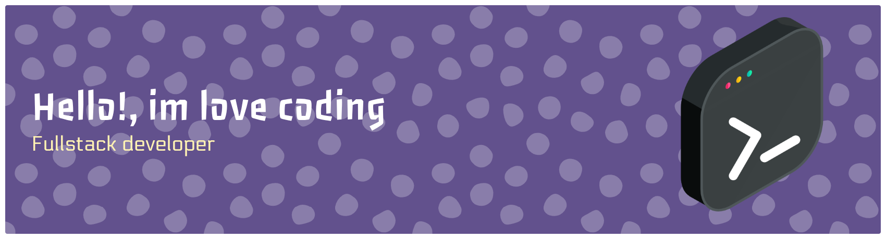

<!-- ====== Banner from your repository ====== -->

  

<h1 align="center">⚡ Coding – My Life ⚡</h1>

  <em>"Code. Create. Evolve."</em>

---

### 👨‍💻 About Me

Hey! I'm a **coder** passionate about creating, exploring, and pushing boundaries in tech.  
I love building things from scratch, solving problems, and writing clean, efficient code.  
Coding isn’t just my job — it’s my **way of life**. 🚀  

---

### 🧠 Programming Languages

  
  
  
  
  
  

---

### ⚙️ Tools & Technologies

  
  
  
  
  
  
  

---

### 💬 Quote

  <em>“Eat. Sleep. Code. Repeat.”</em>

